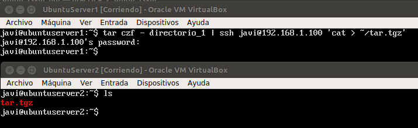
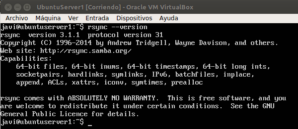
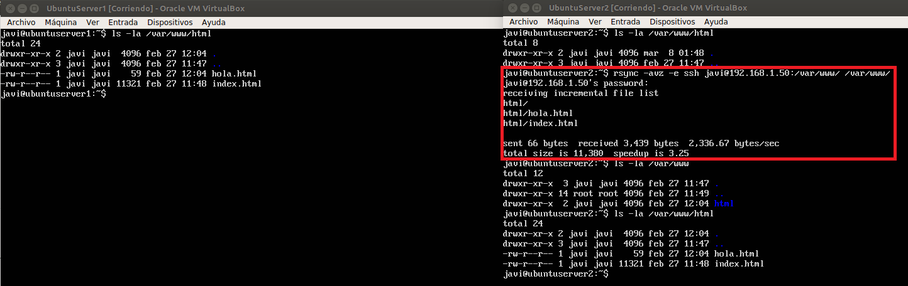
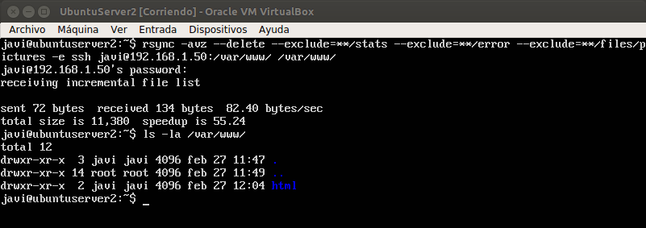
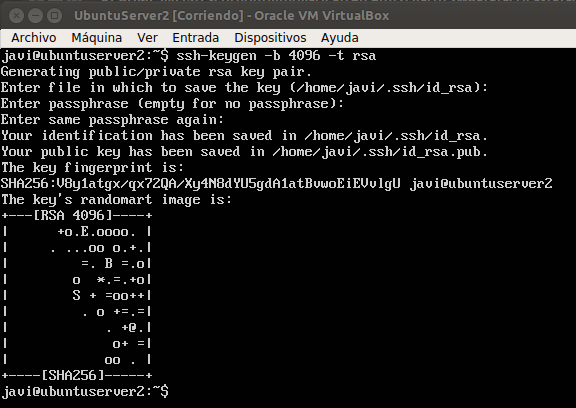
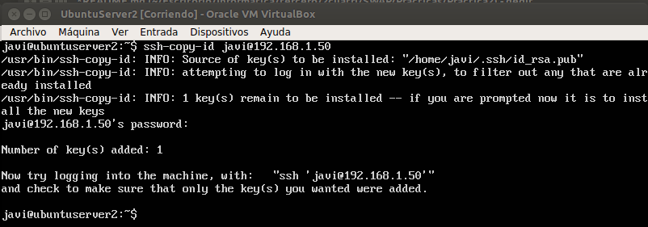
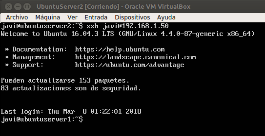
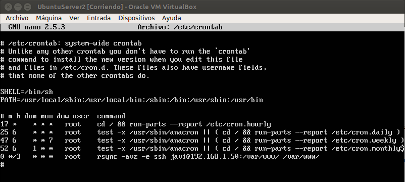

# SWAP1718
## **Práctica2 : Clonar la información de un sitio web**    

El objetivo de la práctica2 es aprender copiar archivos con ssh, clonar contendido entre máquinas, configurar ssh para acceder
a máquinas remotas sin contraseña y establecer tareas con cron.     

Para ello lo que he hecho ha sido: 

### Copiar archivos con SSH    
***
Para copiar archivos entre una máquina y otra mediante *ssh* usamos el siguiente comando:

`tar czf - directorio_1 | ssh javi@192.168.1.100 'cat > ~/tar.tgz'`

Con esto lo que conseguimos es comprimir el contenido de 'directorio_1' y enviar el archivo comprimido a la máquina destino.   

Pero esto no nos sirve para sincronizar grandes cantidades de información, luego usamos rsync.   

### Instalando y usando la herramienta rsync   
***

Para instalar rsync en nuestras máquinas hay que ejecutar el siguiente comando:

`sudo apt-get install rsync`

Para comprobar que lo hemos instalado correctamente al igual que con apache ejecutamos:

`rsync --version`

Una vez hecho esto, vamos a copiar el directorio */var/www/* de la maquina1 a la maquina2, para ello ejecutamos en la maquina2
el siguiente comando: 

`rsync -avz -e ssh javi@192.168.1.50:/var/www/ /var/www/`

Como podemos ver antes de hacer el `rsync` en la maquina2 no hay nada en el directorio */var/www/html* , una vez hecho vemos como
copia en la maquina2 el directorio y todo el contenido que hay en él.

Si quisieramos ignorar ciertos directorios en nuestra copia podemos usar el parámetro `--exclude` y con el parámetro `--delete`
los ficheros que se hayan eliminado en la maquina1 tambien se eliminan en la máquina2.

Para ello debemos ejecutar:

`rsync -avz --delete --exclude=**/stats --exclude=**/error --exclude=**/files/pictures -e ssh javi@192.168.1.50:/var/www/ /var/www/`

### Acceder a SSH sin contraseña
***

Para poder acceder mediante SSH de una máquina a otra, lo que tenemos que hacer es generar un par de claves RSA. 
Para ello ejecutamos el comando:

`ssh-keygen -b 4096 -t rsa`

Lo cual muestra por pantalla:

Tras hacer esto tenemos que copiar la llave pública a la maquina1. Para ello:

`ssh-copy-id javi@192.168.1.50`

Para comprobar que la copia se ha realizado correctamente nos conectamos a la maquina1 mediante SSH y vemos como esta vez
no nos pide contraseña.

### Actualizar el contenido de /var/www/ con crontab
***

cron es un administrador de procesos en segundo plano que ejecuta procesos en el instante indicado en el fichero crontab.
Podemos agregar nuevas tareas a cron para automatizar algunos procesos.

Por ello editamos el archivo */etc/crontab* mediante:

`sudo nano /etc/crontab`

Una vez dentro de ese archivo, añadimos la siguiente linea:

`0 */3 * * * root sync -avz -e ssh javi@192.168.1.50:/var/www/ /var/www`

Con *0 \*/3 \* \* \** indicamos que se ejecute la orden ssh en el minuto 0 cada 3 horas. 

El resultado del fichero crontab es el siguiente:

