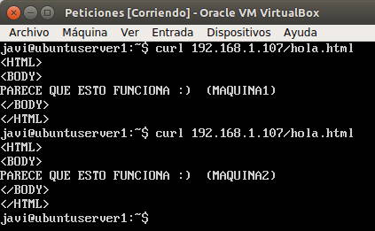
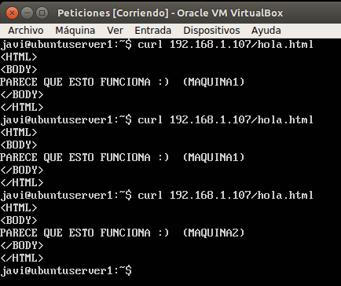

# SWAP1718
## **Práctica3 : Balanceo de carga**    

El objetivo de la práctica 3 es aprender a configurar un balanceador que reparta la carga entre varios servidores finales conectados en una red, para solucionar el problema de la sobrecarga de los servidores. 
Así conseguimos una infraestructura redundante y de alta disponibilidad.     

Para ello lo que he hecho ha sido: 

### Red de las máquinas
***

Dejar claro que el tipo de red que tengo entre las máquinas es: red interna.    
La dirección de red en la que están todas las máquinas es: **192.168.1.0**

En particular:
	
	ubuntuserver1 :   192.168.1.105
	ubuntuserver2 :   192.168.1.100
	balanceador   :   192.168.1.107
	peticiones    :   192.168.1.110

### Balancear la carga usando nginx 
***

Para instalar nginx he ejecutado:

`sudo apt-get install nginx`

Iniciamos el servicio y comprobamos que está activo:

Una vez lo tenemos instalado, pasamos a configurar nginx ya que la configuración que viene por defecto no nos sirve.
Para ello modificamos el fichero de configuración **/etc/nginx/conf.d/default.conf** añadiendo lo siguiente:

Para que nginx deje de funcionar como servidor y empieze a trabajar como balanceador tenemos que modificar el fichero `nginx.conf` que se encuentra en la ruta `/etc/nginx/nginx.conf`. En él, tendremos que comentar la siguiente línea:

`include /etc/nginx/sites-enabled/*;`

### Configurar nginx para balanceo ponderado

Usamos este tipo de balanceo si sabemos que alguna de las máquinas finales es más potente, para ello modificamos la definición del “upstream” de una de las máquinas para pasarle más tráfico que al resto de las del grupo. Para que esto sea posible tenemos el modificador “weight”, al que le damos un valor numérico distinto de 1 (valor por defecto).

Cambiando el nivel de carga. (La máquina1 tiene el doble de capacidad que la máquina2)

Para comprobar las diferencias entre los balanceos, hago peticiones mediante curl a la ip del balanceador. (192.168.1.107)

### Funcionamiento balanceo Round-Robin

### Funcionamiento balanceo ponderado

Como podemos observar en el primer caso reparte la carga por igual, hace una petición a cada máquina. En cambio en el segundo caso,
como hemos dicho que la maquina1 tiene el doble de capacidad que la maquina2 en este caso el balanceador hace 2 peticiones a la maquina1 y 1 a la maquina2.

### Balancear la carga usando haproxy
***

Para instalar haproxy he ejecutado:

`sudo apt-get install haproxy`

Iniciamos el servicio y comprobamos que está activo:

Una vez instalado, debemos indicarle las IPs de las dos máquinas servidoras. Para ello, modificamos el fichero **/etc/haproxy/haproxy.cfg** añadiendo a la configuración de haproxy lo siguiente:

### Comprobar que funciona

Para lanzar haproxy una vez hemos cambiando su configuración ejecutamos el siguiente comando:

`sudo /usr/sbin/haproxy -f /etc/haproxy/haproxy.cfg`

Y a continuación mandamos peticiones desde el anfitrión y vemos como equireparte la carga entre ambas máquinas finales.

### Someter a una alta carga a la granja web
***

Para mandar peticiones con una determinada carga a nuestra granja web, he instalado Apache Benchmark (**ab**) en mi máquina anfitriona ejecutando:

`sudo apt–get install –y apache2`

## nginx

Para probar nuestra granja web con un balanceador nginx, vamos a lanzar 90000 peticiones de 10 en 10 con apache benchmark a nuestro balanceador, pidiendo la página hola.html

`ab -n 90000 -c 10 http://192.168.1.107/hola.html`

### Comprobando con htop     
    

### Salida del ab    

En este caso, he realizado 90000 peticiones al servidor, donde ha tardado 63.721 segundos en hacer el test completo, no ha habido peticiones fallidas lo que quiere decir que el servidor no se ha saturado al realizar este test.

Podemos observar como es capaz de atender 1412.40 peticiones por segundo, tardando unos 7.080 ms de media por petición y a una velocidad de transferencia de 466.20 Kbytes/sec.

## haproxy

Para poner a prueba nuestro servidor con haproxy como balanceador de carga hemos hecho 90000 peticiones haciendo las peticiones de 10 en 10. (Igual que con nginx)

`ab -n 90000 -c 10 http://192.168.1.107/hola.html`

### Comprobando con htop     

### Salida del ab

En este caso, con las mismas peticiones(90000), ha tardado 53.685 segundos en hacer el test completo, no ha habido fallos, luego el servidor no se ha saturado.

En este caso se han realizado 1676.46 pet/s, tardando 5.965 ms de media por petición y a una velocidad de transferencia de 555.00 Kbytes/sec.

## Comparación de balanceadores

Como hemos observado los dos balanceadores han podido responder a todas las peticiones y ninguno se ha saturado, pero vemos un mejor rendimiento en **haproxy** debido a que los tiempos de respuestas son menores, tiene mayor tasa de pet/s y una mayor velocidad de
transferencia.

Aquí podemos ver una comparación de tiempos:

| Balanceador | Tiempo total | Peticiones fallidas | Peticiones/segundo | Tiempo/Petición | Velocidad de transferencia |
|-------------|--------------|---------------------|--------------------|-----------------|----------------------------|
| nginx       | 63.721 s     | 0	    	   | 1412.40		| 7.080 ms	  | 466.20 Kbytes/sec          |
| haproxy     | 53.685 s     | 0		   | 1676.46 		| 5.965 ms        | 555.00 Kbytes/sec          |

		

