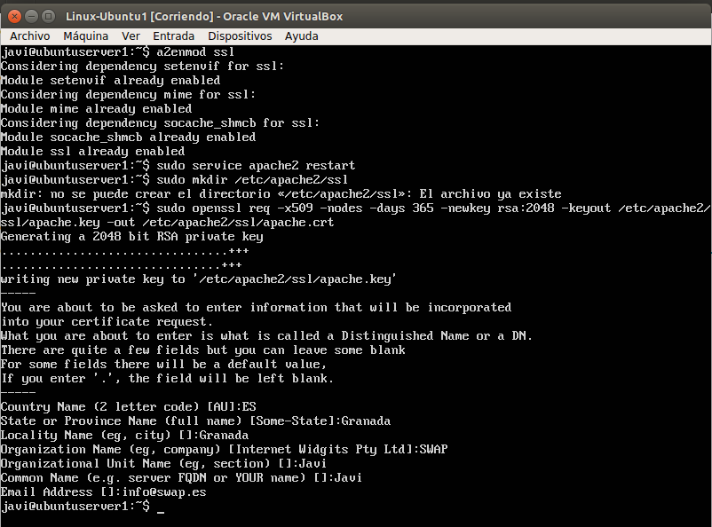

# SWAP1718
## **Práctica4 : Asegurar la granja web**    

El objetivo de la práctica 4 es llevar a cabo la configuración de seguridad de la granja web.     

Para ello lo que he hecho ha sido: 

### Instalar un certificado SSL autofirmado para configurar el acceso por HTTPS
***

Para generar nuestro certificado SSL autofirmado debemos hacer lo siguiente:    

-Se activan una serie de módulos: `a2enmod ssl`

-Reiniciamos el servicio de apache2 : `service apache2 restart`

-Creamos la carpeta donde guardaremos nuestro certificado SSL: `mkdir /etc/apache2/ssl`

-Generamos el certificado SSL :    

	`openssl req -x509 -nodes -days 365 -newkey rsa:2048 -keyout /etc/apache2/ssl/apache.key -out /etc/apache2/ssl/apache.crt`

Como podemos ver nos pide una serie de datos para configurar el dominio.

A continuación tenemos que editar el archivo de configuración de nuestro servidor para añadir nuestro certificado previamente
creado e indicar que lo utilice:

`sudo nano /etc/apache2/sites-available/default-ssl`

Y añadimos las siguientes líneas

Una vez modificado, tenemos que activar el sitio y reiniciar apache:

Para comprobar que funciona hacemos las peticiones mediante curl y como vemos si no ponemos el **-k** no nos dejaría:

### Configuración del cortafuegos
***

En primer lugar para ver el estado del cortafuegos ejecutamos: `iptables -L -n -v`

Como vemos se acepta todo el tráfico ya que aún no hay ninguna regla definida.    

### IPTABLES

Como vemos iptables tiene muchas funcionalidades para establecer reglas, filtrar tipos de tráfico o bien controlar el acceso a ciertas páginas.    
Algunas de ellas pueden ser:

Si queremos que bloquee todo el tráfico tanto de entrada como de salida:

	`iptables -P INPUT DROP`
	`iptables -P OUTPUT DROP`
	`iptables -P FORWARD DROP`
	

Si queremos bloquear el tráfico de entrada y permitir el de salida:

	`iptables -P INPUT DROP`
	`iptables -P FORWARD DROP`
	`iptables -P OUTPUT ACCEPT`
	`iptables -A INPUT -m state --state NEW, ESTABLISHED -j ACCEPT`

Si queremos bloquear trafico ICMP para evitar ataques mediante ping:

	`iptables -A INPUT -p icmp --icmp-type echo-request -j DROP`

Si queremos permitir el acceso por SSH, abriendo el puerto 22:

	`iptables -A INPUT -p tcp --dport 22 -j ACCEPT`
	`iptables -A OUTPUT -p udp --sport22 -j ACCEPT`

Si queremos permitir el acceso a DNS, abriendo el puerto 53:

	`iptables -A INPUT -m state --state NEW -p udp --dport 53 -j ACCEPT`
	`iptables -A INPUT -m state --state NEW -p tcp --dport 53 -j ACCEPT`

Si queremos bloquear todo el tráfico de entrada o salida desde una IP:

	`iptables -I INPUT -s 192.168.1.100 -j DROP`
	`iptables -I OUTPUT -s 192.168.1.100 -j DROP`

IDEM para aceptar pero usando ACCEPT en vez de DROP.     

Por último para comprobar el funcionamiento del cortafuegos y ver que puertos hay abiertos:

	`netstat -tulpn`

### SCRIPT

Lo habitual es crear un script que se ejecute en el arranque del sistema.    

Tenemos que crear un script para permitir el acceso por los puertos de HTTP y HTTPS al servidor (máquina1), para ello:

Para que se ejecute cuando iniciamos la máquina virtual. Añadimos lo siguiente al crontab:

El parametro & del final sirve para que el proceso se ejecute en segundo plano.

	

