# SWAP1718
## **Práctica5 : Replicación de bases de datos MySQL**    

Los objetivos de la práctica 5 son: clonar manualmente BD entre máquinas y configurar la estructura maestro-esclavo entre dos máquinas para realizar el clonado automático de la información.

Para ello lo que he hecho ha sido: 

### Creación de una BD e inserción de datos
***

En todo momento usaremos la interfaz de línea de comandos del MySQL: `mysql -uroot -p`   

Tras esto, crearemos una BD, junto con una tabla, tal y como se ve en la siguiente figura:

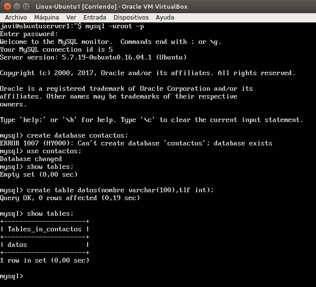

A continuación insertamos algún dato en la BD que acabamos de crear, para tener algo de lo que hacer una copia de seguridad. En nuestro caso, insertaremos en la tabla Pepe y su número de teléfono.

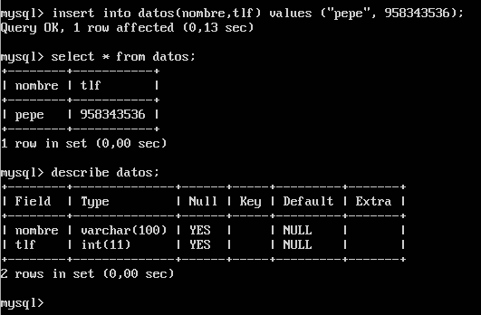

### Replicar una BD con mysqldump
***

Una vez terminada la inserción de datos, para poder hacer la copia de seguridad de forma correcta y que no surjan problemas porque alguien acceda a la BD mientras se está haciendo el volcado con mysqldump, tenemos que bloquear la BD. 

Para ello, volveremos a entrar en el terminal de MySQL y ejecutaremos la siguiente orden:

`FLUSH TABLES WITH READ LOCK;`

Ahora ya sí podemos hacer el mysqldump para volcar los datos. Y a continuación desbloqueamos las tablas.

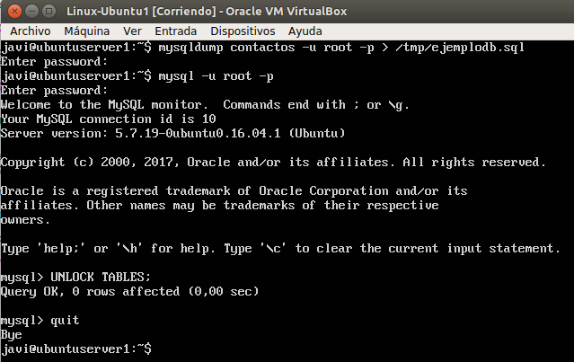

Una vez hecho esto, vamos a la máquina2 para copiar el archivo .sql con todos los datos salvados desde la máquina1.

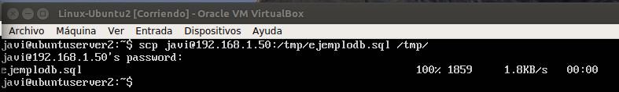

Además es necesario crear en nuestra máquina esclavo (máquina2) la BD correspondiente ya que el mysqldump no incluye ese archivo la sentencia para crear la BD.

Para ello primero creamos la BD y luego restauramos los datos contenidos en la BD (se crean las tablas en el proceso).

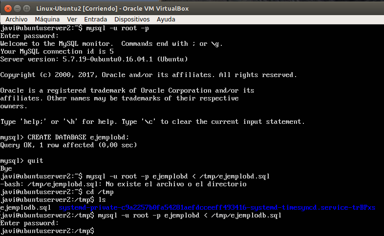

### Replicación de BD mediante una configuración maestro-esclavo.
***

Lo hecho anteriormente está bien, pero podemos mejorarlo configurando un proceso demonio automático, mediante el cual al realizar un cambio en la base de datos **maestro** (máquina1) se vea directamente reflejado en el **esclavo** (máquina2).

Para ello debemos realizar lo siguiente:    

-Comentar la línea `bind-address` del fichero de configuración mysql (maestro).

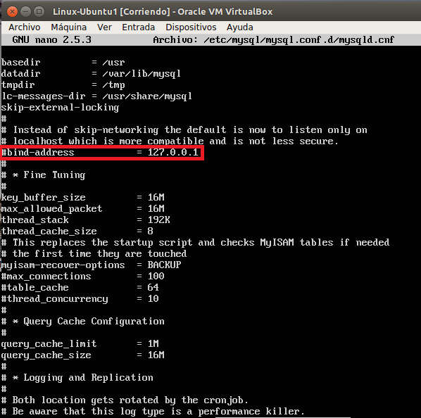

-Añadir el fichero `log_error` para que nos avise de los errore, establecer el id del servidor y, por último el `log_bin` para transacciones seguras.

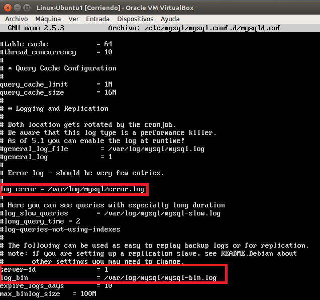

-Reiniciar el servicio mysql.

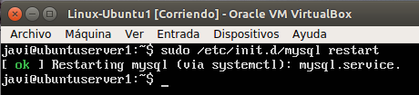

-Hacemos la misma configuración en el esclavo, con la única diferencia de que el `server-id`debe ser 2 en este caso:

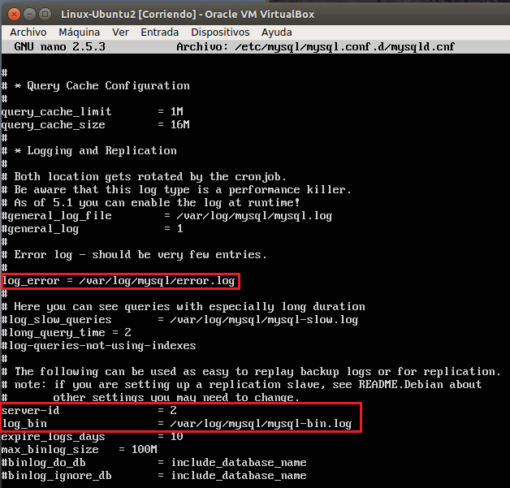
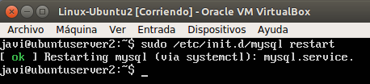

-Creamos un usuario en el maestro y le damos permiso para la replicación. Dicho usuario será `esclavo`y su contraseña `esclavo`también.

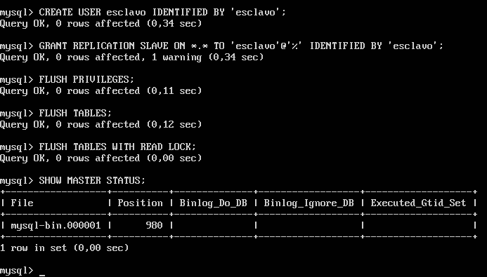

-Indicamos al esclavo los datos del maestro y lo iniciamos.

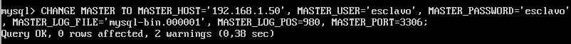
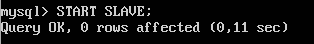

-Volvemos al maestro y volvemos a activar las tablas para poder introducir nuevos datos.

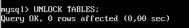

-Por último ejecutamos el comando `SHOW SLAVE STATUS\G` y comprobamos que la variable `Seconds_Behind_Master` es 0, por lo que no hay ningún error y todo funciona como debe.

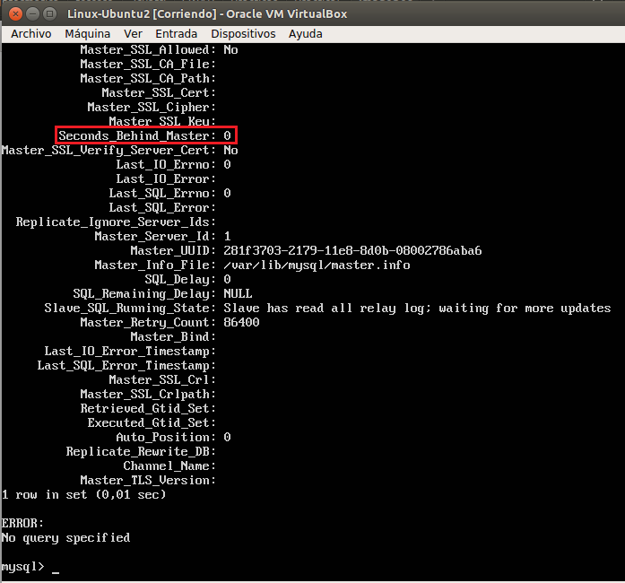

-Con esto concluimos la configuración maestro-esclavo. Si añadimos un dato al maestro, este cambio se verá reflejado en el esclavo.

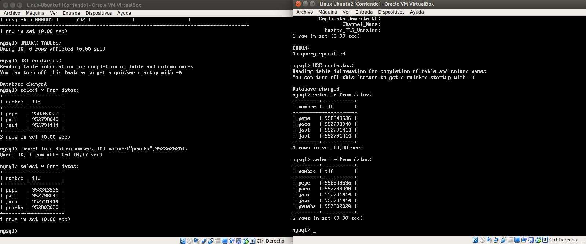

### Opcional: Configuración maestro-maestro
***

Como parte opcional he realizado la configuración maestro-maestro que consiste en lo hecho anteriormente, pero en este caso al revés.   

Y como podemos observar en la siguiente imagen se hace la sincronización en sentido inverso:

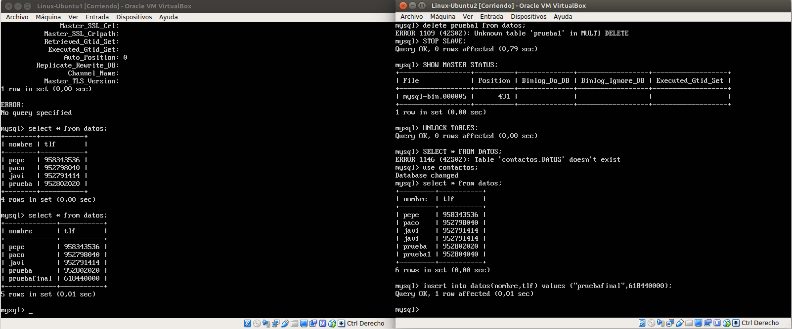

	

